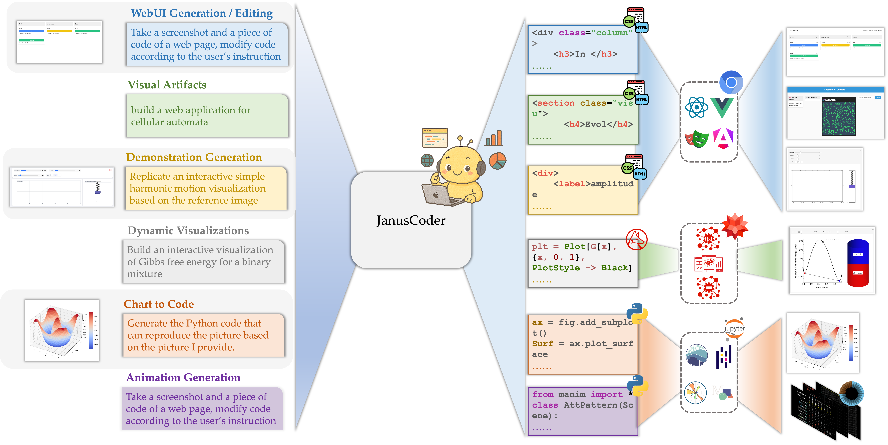
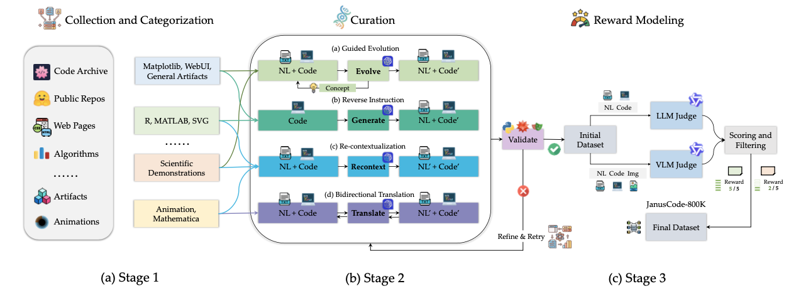

# JanusCoder
[](http://arxiv.org/abs/2510.23538) 
[](./LICENSE)
[](https://huggingface.co/papers/2510.23538)
[](https://discord.com/invite/xa29JuW87d)
<!-- [](https://mp.weixin.qq.com/s/naVskQ9btJFkoUyyQVr7zA) -->
<!-- [](https://qiushisun.github.io/ScienceBoard-Home/) -->
<!-- <a href = "https://zhuanlan.zhihu.com/p/1914038712540574158"></a> -->

JanusCoder: Towards a Foundational Visual-Programmatic Interface for Code Intelligence

## 🗞️ Updates

- **2025-10-29**: We release the  [preprint](http://arxiv.org/abs/2510.23538) and [checkpoints](https://huggingface.co/collections/internlm/januscoder) of JanusCoder series 🤗
- **2025-10-07**: Initial release of our [technical report](./JanusCoder_technical_report.pdf), code, data samples, and [🌐 Project Page](https://qiushisun.github.io/ScienceBoard-Home/). Check it out! 🚀

> [!NOTE]  
This release represents the public implementation; the full implementation and data will be made available after internal company policy requirements are met.

## 📑 Intro

JanusCoder is a suite of open models that establish a unified visual–programmatic interface for multimodal code intelligence. The models (JanusCoder and JanusCoderV) handle text-centric and vision-centric tasks in a single framework—from chart-to-code and web UI generation/editing to dynamic theorem visualizations—and show strong results across public benchmarks, approaching or even surpassing proprietary systems.




> [!NOTE]  
> Due to company policy, we need some additional time to release all datasets and checkpoints. If you require access to more data, please feel free to send qiushisun@connect.hku.hk an email.

## 🤗 Checkpoints

We provide the checkpoints of JanusCoder series on Hugging Face:

| Model Name          | Description                                  | Download(Huggingface)                      | Download(ModelScope)    | 
| ------------------- | -------------------------------------------- | ---------------------------------------------------------- | ---------------------------------------------------------- |
| JanusCoder-8B | 8B text model based on Qwen3-8B.             | 🤗 [Model](https://huggingface.co/internlm/JanusCoder-8B)  | 🤖 [Model](https://www.modelscope.cn/models/Shanghai_AI_Laboratory/JanusCoder-8B)  |
| JanusCoder-14B      | 14B text model based on Qwen3-14B.           | 🤗 [Model](https://huggingface.co/internlm/JanusCoder-14B) | 🤖 [Model](https://www.modelscope.cn/models/Shanghai_AI_Laboratory/JanusCoder-14B) |
| JanusCoderV-7B      | 7B multimodal model based on Qwen2.5-VL-7B.  | 🤗 [Model](https://huggingface.co/internlm/JanusCoderV-7B) | 🤖 [Model](https://www.modelscope.cn/models/Shanghai_AI_Laboratory/JanusCoderV-7B) |
| JanusCoderV-8B      | 8B multimodal model based on InternVL3.5-8B. | 🤗 [Model](https://huggingface.co/internlm/JanusCoderV-8B) | 🤖 [Model](https://www.modelscope.cn/models/Shanghai_AI_Laboratory/JanusCoderV-8B) |


## ⚙️ Data Synthesis Toolkit

We provide a versatile data synthesis toolkit that generates multimodal code data across heterogeneous domains—ranging from charts and Web UIs to visual artifacts and code-driven animations—while greatly reducing engineering efforts for large-scale corpus creation. 





Since the process of building JanusCode data involves a variety of synthesis pipelines, we provide a few examples here:

### Example Workflows:

Extend, refine and derive new text-centric data for chart tasks
   
```bash
python data_synthesis/viscode_extend_synthesis_pipeline.py \
  --input-path path/to/source.jsonl \
  --output-path path/to/output.jsonl \
  --api-timeout [Optional, seconds before timeout for each api request] \
  --execution-timeout [Optional, seconds before timeout for each script execution] \
  --num-worker [Optional, number of parallel workers] \
  --solver-url-base [base url for solver agent] \
  --solver-api-key [api key for solver agent] \
  --solver-model-name [model name for solver agent] \
  --solver-temperature [Optional, model temperature for solver agent] \
  --judge-url-base [base url for judge agent] \
  --judge-api-key [api key for judge agent] \
  --judge-model-name [model name for judge agent] \
  --judge-temperature [Optional, temperature for judge agent] \
  --total-trial [Optional, total trial of extension]
```

Extend and derive new text-centric data for visual editing tasks

```bash
python data_synthesis/viscode_edit_synthesis_pipeline.py 
  --input-path path/to/source.jsonl \
  --output-path path/to/output.jsonl \
  --api-timeout [Optional, seconds before timeout for each api request] \
  --execution-timeout [Optional, seconds before timeout for each script execution] \
  --num-worker [Optional, number of parallel workers] \
  --solver-url-base [base url for solver agent] \
  --solver-api-key [api key for solver agent] \
  --solver-model-name [model name for solver agent] \
  --solver-temperature [Optional, model temperature for solver agent] \
  --judge-url-base [base url for judge agent] \
  --judge-api-key [api key for judge agent] \
  --judge-model-name [model name for judge agent] \
  --judge-temperature [Optional, temperature for judge agent] \
  --start-index [Optional, start index if you only want to process part of your dataset] \
  --end-index [Optional, end index if you only want to process part of your dataset] \
  --max-retries [Optional, max exploration retries for each sample]
```

More scripts will be released soon.

Data Samples:
1. We provide text-centric data samples [at this link](https://drive.google.com/file/d/1dSxNf-co4LGh93NoiUgWKdbcf8Mo_VWG/view?usp=sharing).
2. We provide vision-centric data samples [at this link](https://drive.google.com/file/d/1dSxNf-co4LGh93NoiUgWKdbcf8Mo_VWG/view?usp=sharing).


## 🧪 Training
We primarily follow the official training pipelines provided. Users can directly refer to the linked repositories for detailed instructions on SFT.

| Our Model        | Upstream Base | Training Pipelines |
|-------------------|---------------|----------------------------------|
| 🤗 [JanusCoder-8B](https://huggingface.co/internlm/JanusCoder-8B)     | [Qwen/Qwen3-8B](https://huggingface.co/Qwen/Qwen3-8B) | [Qwen3 GitHub](https://github.com/QwenLM/Qwen) |
| 🤗 [JanusCoder-14B](https://huggingface.co/internlm/JanusCoder-14B)    | [Qwen/Qwen3-14B](https://huggingface.co/Qwen/Qwen3-14B) | [Qwen3 GitHub](https://github.com/QwenLM/Qwen) |
| 🤗 [JanusCoderV-7B](https://huggingface.co/internlm/JanusCoderV-7B)    | [Qwen/Qwen2.5-VL-7B-Instruct](https://huggingface.co/Qwen/Qwen2.5-VL-7B-Instruct) | [Qwen-VL GitHub](https://github.com/QwenLM/Qwen-VL) |
| 🤗 [JanusCoderV-8B](https://huggingface.co/internlm/JanusCoderV-8B)    | [OpenGVLab/InternVL3_5-8B](https://huggingface.co/OpenGVLab/InternVL3_5-8B) | [InternVL GitHub](https://github.com/OpenGVLab/InternVL) |

We also provide some typical training configuration file for llamafactory users in [training_files](./training_files/).

All our experiments were conducted on interconnected 8× H800 GPUs.

## 📏 Evaluation


We provide several ready-to-use scripts to quickly reproduce our experimental results. You can replace them with other scripts under the evaluation directory to evaluate different tasks, for example:

```bash
bash DesignBench/scripts/designbench_vllm-januscoderv.sh
```

```bash
bash evaluation/ArtifactBench/artifactbench-januscoder.sh
```

```bash
bash evaluation/InteractScience/interactscience-januscoderv.sh
```

For evaluations on LiveCodeBench-v6, MBPP+: We directly adopt the evaluation scripts provided by OpenCompass.

For evaluations on [Artifactbench](https://github.com/Tencent-Hunyuan/ArtifactsBenchmark) and [Interactscience](https://github.com/open-compass/InteractScience) can be run the instructions in their original repositories. You can fork/clone the original repos to reuse their official environments and configs.


## 📚License
This project is licensed under the Apache 2.0 License. See the LICENSE file for details.

## 💐Acknowledgement
We thank [Fangzhi Xu](https://xufangzhi.github.io/) and [Zhangyue Yin](https://scholar.google.com/citations?user=9gRQqSkAAAAJ) for their valuable feedback on improving the manuscript's presentation, and [Zichen Ding](https://heroding77.github.io/) for the assistance in resolving issues encountered during the training of InternVL 3.5. We are also grateful to [Fahd Mirza](https://www.youtube.com/@fahdmirza) for creating an nice [YouTube video](https://www.youtube.com/watch?v=fbNZn1WF8mI) on running JanusCoder locally.


## 📋 Citation
🫶  If you are interested in our work or find the repository / checkpoints / benchmark / data helpful, please consider using the following citation format when referencing our papers:

```bibtex
@article{sun2025januscoder,
  title={JanusCoder: Towards a Foundational Visual-Programmatic Interface for Code Intelligence},
  author={Sun, Qiushi and Gong, Jingyang and Liu, Yang and Chen, Qiaosheng and Li, Lei and Chen, Kai and Guo, Qipeng and Kao, Ben and Yuan, Fei},
  journal={arXiv preprint arXiv:2510.23538},
  year={2025}
}

@article{sun2024survey,
  title={A survey of neural code intelligence: Paradigms, advances and beyond},
  author={Sun, Qiushi and Chen, Zhirui and Xu, Fangzhi and Cheng, Kanzhi and Ma, Chang and Yin, Zhangyue and Wang, Jianing and Han, Chengcheng and Zhu, Renyu and Yuan, Shuai and others},
  journal={arXiv preprint arXiv:2403.14734},
  year={2024}
}

@article{chen2025interactscience,
  title={InteractScience: Programmatic and Visually-Grounded Evaluation of Interactive Scientific Demonstration Code Generation},
  author={Chen, Qiaosheng and Liu, Yang and Li, Lei and Chen, Kai and Guo, Qipeng and Cheng, Gong and Yuan, Fei},
  journal={arXiv preprint arXiv:2510.09724},
  year={2025}
}

@article{sun2025codeevo,
  title={CodeEvo: Interaction-Driven Synthesis of Code-centric Data through Hybrid and Iterative Feedback},
  author={Sun, Qiushi and Gong, Jinyang and Li, Lei and Guo, Qipeng and Yuan, Fei},
  journal={arXiv preprint arXiv:2507.22080},
  year={2025}
}

```